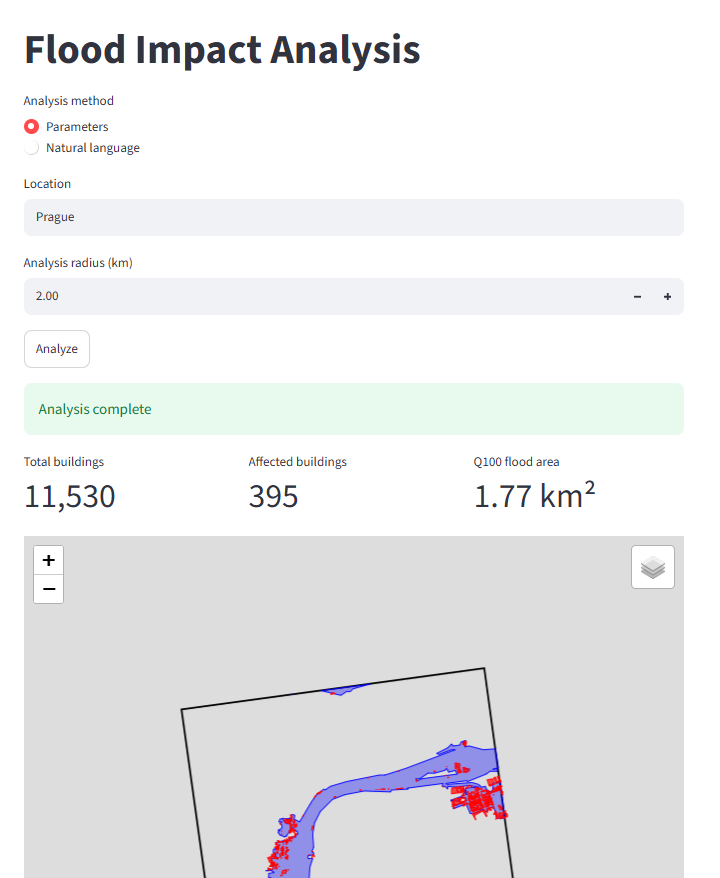
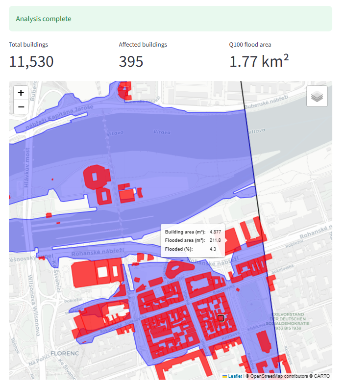

# Flood Impact Analysis

A geospatial application for identifying buildings whose footprints intersect Q100 flood zones in the Czech Republic. It calculates building exposure and displays the analysis area, flood zone, and affected buildings on an interactive map.   

Users can define the analysis directly using location and radius parameters or describe the requested analysis in natural language.  

## Features

- Analyze an area using explicit location and radius parameters.
- Describe an analysis in natural language and convert it into validated location and radius parameters.
- Validate AI-extracted parameters with Pydantic before starting geospatial processing.
- Retrieve Q100 flood-zone geometry for the selected area.
- Retrieve building footprints from OpenStreetMap.
- Identify buildings with positive-area overlap with the flood zone.
- Calculate total and flooded building footprint area and percentage exposure.
- Display flood zones, affected buildings, and the analysis area on an interactive map.
- Validate that the complete analysis area lies within the Czech Republic.

## Data Limitations

- The analysis is currently limited to areas entirely within the Czech Republic.
- Flood exposure is based on the Q100 flood-zone dataset, representing areas associated with a 1% annual exceedance probability.
- A building is considered affected when its footprint has a positive-area geometric overlap with the Q100 flood zone. This represents spatial exposure, not an assessment of structural damage or flood risk to occupants.
- VÚV flood-zone polygons are orientational. For authoritative information about the exact extent of a flood zone, consult the relevant water authority or watercourse administrator.
- Building footprints are obtained from OpenStreetMap and their availability and accuracy depend on the underlying OSM data.

## How It Works

        parameter input              natural-language input  
              │                              │  
              │                         OpenAI extraction  
              │                              │  
              │                      Pydantic validation  
              │                              │  
              └──────────────┬───────────────┘  
                             ↓  
                          geocode  
                             ↓  
                    create analysis area  
                             ↓  
                   validate Czech coverage  
                    ├── invalid → stop  
                    │  
                    └── valid  
                            ↓  
                        VÚV request  
                            ↓  
                        OSM request  
                            ↓  
                        analysis  
  
Natural-language input is used only to extract a location and analysis radius into a validated structured request. Geocoding, flood-zone retrieval, building retrieval, spatial intersection, exposure calculations, and mapping remain deterministic.    

## Architecture

        FloodImpactAnalysis/  
        ├── floodimpactanalysis.py  
        ├── data/  
        │   └── czech_republic.geojson  
        ├── screenshots/  
        │   ├── brno-analysis-natural-language.png  
        │   ├── prague-analysis-parameters.png  
        │   └── prague-map.png  
        ├── src/  
        │   ├── flimpanal_ai.py  
        │   ├── flimpanal_geo.py  
        │   ├── flimpanal_map.py  
        │   └── flimpanal_ui.py  
        └── tests/  
            ├── test_flimpanal_ai.py  
            ├── test_flimpanal_geo.py  
            └── test_flimpanal_map.py  
  

## Technology Stack

- **Python** — application language
- **Streamlit** — web UI
- **OSMnx / OpenStreetMap** — geospatial data retrieval
- **GeoPandas / Shapely / pyproj** — geospatial processing
- **GeoPy** — geocoding and distance utilities
- **Folium / CARTO Positron** — interactive map visualization
- **OpenAI API** — natural-language request interpretation
- **Pydantic** — structured request validation

## External Services/Data Used

OpenAI                                          → natural-language request interpretation  
Nominatim                                       → location geocoding  
Natural Earth                                   → Czech Republic coverage validation  
Výzkumný ústav vodohospodářský (VÚV)            → Q100 flood-zone geometry  
OpenStreetMap                                   → building footprints  
CARTO Basemap                                   → basemap tiles providing visual context  

### OpenAI

Used to interpret natural-language analysis requests and extract structured location and radius parameters.  
  
The extracted values are validated by the application before geospatial processing begins. OpenAI is not used for flood-zone geometry, spatial intersection, exposure calculations, or determination of affected buildings.  

OpenAI Usage Policies:  
https://openai.com/policies/usage-policies/

### Nominatim

Used for forward geocoding of user-entered locations.

This application uses the public Nominatim service operated by the OpenStreetMap Foundation. Use of the public service is subject to the Nominatim Usage Policy, including an absolute maximum of one request per second and use of an identifying User-Agent.

Nominatim Usage Policy:  
https://operations.osmfoundation.org/policies/nominatim/

### Natural Earth

Used to validate that the complete analysis area lies within the Czech Republic.  

The application uses the Natural Earth 1:10m Admin 0 Countries dataset. Natural Earth vector and raster data is in the public domain.  
  
Natural Earth Terms of Use:  
https://www.naturalearthdata.com/about/terms-of-use/

### OpenStreetMap

Used as the source of building footprints.  

OpenStreetMap data is licensed under the Open Data Commons Open Database License (ODbL). OpenStreetMap and its contributors must be credited when the data is used.  

© OpenStreetMap contributors  

Copyright and License:  
https://www.openstreetmap.org/copyright

### Výzkumný ústav vodohospodářský T. G. Masaryka (VÚV TGM)

Used as the source of Q100 flood-zone geometry for the Czech Republic.

The flood-zone dataset is provided under Creative Commons BY 4.0. Source attribution is required when the data is presented.

Source: Výzkumný ústav vodohospodářský T. G. Masaryka, v.v.i. (VÚV TGM)

The flood-zone polygons provided by this dataset are orientational. For authoritative information about the exact extent of a flood zone, consult the relevant water authority or watercourse administrator.

Flood-zone metadata:  
https://heis.vuv.cz/xmicka/record/basic/CZ-VUV-MD-ZaplavUzemi

### CARTO Basemap (Positron)

Used as the basemap tile layer for the interactive map, providing geographic context for the analysis results.  
  
A CARTO Basemaps API key is required to display the Positron raster basemap. The application can still display analysis results without the basemap if no CARTO API key is configured.  
  
CARTO Basemaps API Key:  
https://www.carto.com/basemaps/apikey  

## Getting Started

The examples below use Windows.  

### 1. Clone the repository

    git clone https://github.com/Luke-75/FloodImpactAnalysis.git

### 2. Create and activate a virtual environment

    cd FloodImpactAnalysis

    python -m venv .venv
    .venv\Scripts\activate

### 3. Install dependencies

    python -m pip install -r requirements.txt

### 4. Configure the application

The application uses Nominatim for geocoding and the OpenAI API for optional natural-language request interpretation.  
  
Copy `.env.example` to `.env`:

    copy .env.example .env

Then edit `.env` and configure the required environment variables:  

    NOMINATIM_USER_AGENT_NAME="FloodImpactAnalysis"  
    OPENAI_API_KEY="<YOUR OPENAI API KEY HERE>"  
    CARTO_BASEMAP_API_KEY="<YOUR CARTO BASEMAP API KEY HERE>"  

An OpenAI API key is required only when using the Natural language analysis method. Parameter-based analysis does not require OpenAI.  

A CARTO API key is optional - if you do not obtain and configure this API key, analysis results will be displayed without a basemap.

The `.env` file is excluded from Git and should not be committed.

### 5. Run the application

Run floodimpactanalysis.py through Streamlit:

    python -m streamlit run floodimpactanalysis.py

## Running Tests

The project includes automated tests for AI request parsing and validation, geospatial processing, external-data handling, application orchestration, and map generation. OpenAI interactions are mocked in the automated tests, so the test suite does not make real API requests.  

The tests are organized into three modules:

    tests/
    ├── test_flimpanal_ai.py
    ├── test_flimpanal_geo.py
    └── test_flimpanal_map.py

Install the development dependencies:

    python -m pip install -r requirements-dev.txt

Run the complete test suite from the project root:

    python -m pytest tests -v

## Examples

For example, analyzing `Prague` with a 2 km radius produces an analysis area covering central Prague.  
  
For this area, the application:  

- retrieves 11,530 building footprints from OpenStreetMap,
- identifies 395 buildings with positive-area overlap with the Q100 flood zone,
- calculates approximately 1.77 km² of Q100 flood-zone area within the
  analysis area,
- calculates the flooded footprint area and percentage exposure for each
  affected building.

The interactive map displays:  

- the analysis-area boundary,
- the Q100 flood zone,
- affected building footprints.

Hovering over an affected building displays its total footprint area, flooded footprint area, and percentage exposure.  
  
The same analysis can also be initiated with a natural-language request, for example:  

    Show me buildings exposed to flooding within 3 km of Brno.

The application interprets this as `Brno` with a `3 km` analysis radius, validates the extracted parameters, and passes them to the same deterministic geospatial pipeline used by parameter-based analysis.  
  

## Screenshots

### Analysis output - Parameters

### Analysis output - Natural Language

### Building exposure detail

